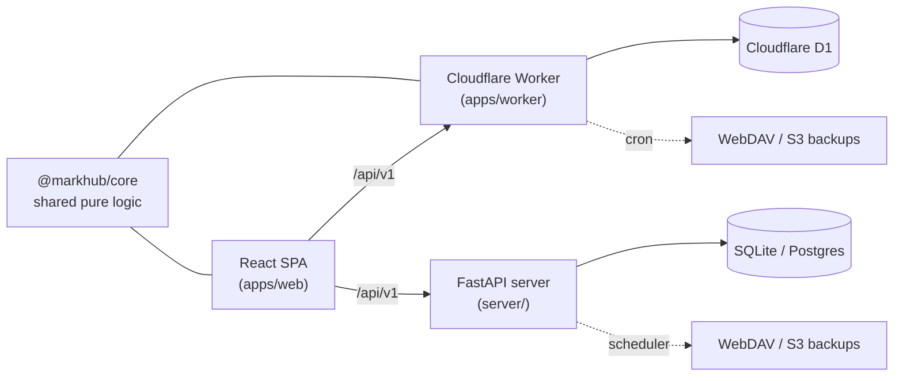

# MarkHub

**English** | [简体中文](README.zh-CN.md)

[](https://deploy.workers.cloudflare.com/?url=https://github.com/NoneAble/mark-hub)

Self-hosted bookmark hub with a public navigation home page. Organize bookmarks in nested folders with tags, search them instantly, and keep everything backed up to WebDAV or S3/R2 — deployable to **Cloudflare Workers + D1** (one click, free-tier friendly) or **Docker** (FastAPI + SQLite/Postgres).

Everything happens on one page — there is no separate admin area. Log in, toggle **edit mode** (`⌘/Ctrl+E`) to manage bookmarks, folders and tags in place (drag reorder, batch actions, archive); account, import/export and backup settings live in the top-right menu.

## Features

- **Folders / categories** — nested tree with per-folder visibility (public / unlisted / private), drag & drop reorder, system Inbox
- **Bookmarks** — quick add with automatic title/description/favicon fetching, favorites, archive, batch move/tag/visibility
- **Tags** — colored tags with tag-aware search and batch tagging
- **Search** — FTS5 full-text search across title, URL, description and tags, with LIKE fallback
- **Public home page** — publish your public folders as a navigation site; private items stay invisible without login
- **Import / export** — lossless JSON, CSV and Netscape HTML (browser-compatible); `skip_duplicate` / `merge` / `replace_all` strategies; `replace_all` is fully atomic with per-user locking, verified up to 50,000 bookmarks
- **Scheduled remote backups** — daily WebDAV and S3/R2 backups with retention pruning, connection tests, and visible retention-failure reporting
- **Single admin account** — JWT auth, forced password change on first login, backup credentials encrypted at rest

## Architecture

Two interchangeable runtimes serve the same REST API (`/api/v1`) behind the same React SPA. Shared logic (URL normalization, visibility rules, import parsers, backup scheduling) lives in one TypeScript package, and a live parity suite keeps the two backends behaviorally identical.



```
apps/web          React + Vite SPA (public home, edit mode, settings)
apps/worker       Cloudflare Workers + D1 runtime (API + cron backups)
server/           FastAPI runtime (Docker; SQLite or Postgres, scheduled backups)
packages/core     Shared pure logic (normalizeUrl, visibility, import parsing, schedule)
packages/api-client, packages/ui
docker/           Multi-stage Dockerfile (builds SPA, serves via FastAPI)
scripts/          Test harnesses + repo-local bounded-run watchdog
```

## Deployment

### Option 1 — Cloudflare Workers, one click

[](https://deploy.workers.cloudflare.com/?url=https://github.com/NoneAble/mark-hub)

The button clones this repo into your GitHub account, **provisions a D1 database automatically** (the placeholder `database_id` in `wrangler.toml` is rewritten for you), sets up deploy-on-push CI, and prompts for the three secrets from [.dev.vars.example](.dev.vars.example):

| Secret | Purpose |
|---|---|
| `JWT_SECRET` | Signs login tokens (≥ 16 chars) |
| `MARKHUB_MASTER_KEY` | Encrypts stored backup credentials (≥ 24 chars) |
| `DEFAULT_ADMIN_PASSWORD` | Initial admin password (anything but `admin123`; changed on first login) |

The build runs `pnpm run build` (SPA → `apps/web/dist`); the deploy script applies D1 migrations and then runs `wrangler deploy`. A `*/15 * * * *` cron trigger powers scheduled backups and garbage collection, matching your configured `backup_time` within its 15-minute window (Asia/Shanghai).

### Option 2 — Cloudflare Workers, manual

```bash
pnpm install && pnpm run build
pnpm exec wrangler login
pnpm exec wrangler d1 create markhub      # put the returned id into wrangler.toml → database_id
pnpm exec wrangler secret put JWT_SECRET
pnpm exec wrangler secret put MARKHUB_MASTER_KEY
pnpm exec wrangler secret put DEFAULT_ADMIN_PASSWORD
pnpm run deploy                           # applies REMOTE D1 migrations, then deploys

# smoke test
curl -sS "https://<your-worker>.workers.dev/api/v1/health"
```

### Option 3 — Docker (FastAPI)

```bash
./scripts/generate-docker-env.sh   # or: cp .env.example .env and fill in secrets
docker compose up --build                          # SQLite volume → http://localhost:8080
docker compose --profile postgres-app up --build   # Postgres stack → http://localhost:8081
```

Compose fails fast without real secrets (`JWT_SECRET`, `MARKHUB_MASTER_KEY`, `DEFAULT_ADMIN_PASSWORD`, `POSTGRES_PASSWORD`), and the app refuses known-weak values. In the Postgres stack the database is only reachable on the compose network — no host port is published.

## Development

```bash
# API (FastAPI)
cd server && python3 -m venv .venv && source .venv/bin/activate
pip install -r requirements.txt
JWT_SECRET=dev-secret-16chars-plus MARKHUB_MASTER_KEY=dev-master-key-24-chars-plus \
DEFAULT_ADMIN_PASSWORD=dev-strong-password uvicorn app.main:app --reload --port 8000

# Web (Vite proxies /api → 127.0.0.1:8000)
pnpm install && pnpm --filter @markhub/core build
pnpm --filter @markhub/web dev

# Worker runtime (builds SPA, then local D1 dev)
pnpm run dev:cf
```

## Testing

One entry point gates a release:

```bash
pnpm run test:release
# TS+Python lint → core unit → worker suite (types drift, D1 runtime incl.
# atomic-restore + lease-mutex tests, remote backups, assets/navigation)
# → pytest → browser E2E → Docker lifecycle → 50k-bookmark restore gate

MARKHUB_RELEASE_SKIP_LARGE=1 pnpm run test:release   # skip the slow 50k gate
```

Individual suites: `pnpm test:core`, `pnpm --filter @markhub/worker test`, `pnpm test:server`, `pnpm test:e2e`, `pnpm test:docker`, `pnpm test:parity`. All harnesses are self-contained — a clean checkout plus `pnpm install` (and `server/.venv`) is enough.

## Configuration reference

### Worker (secrets via `wrangler secret put` / `.dev.vars`)

| Variable | Required | Notes |
|---|---|---|
| `JWT_SECRET` | yes | ≥ 16 chars |
| `MARKHUB_MASTER_KEY` | yes | ≥ 24 chars; encrypts WebDAV/S3 credentials |
| `DEFAULT_ADMIN_PASSWORD` | yes | must not be `admin123` |
| `DEFAULT_ADMIN_USERNAME` | no | defaults to `admin` (set in `[vars]`) |

### FastAPI (environment)

| Variable | Required | Notes |
|---|---|---|
| `JWT_SECRET`, `MARKHUB_MASTER_KEY`, `DEFAULT_ADMIN_PASSWORD` | yes | same semantics as the Worker |
| `DATABASE_URL` | no | `sqlite+aiosqlite:///./data/markhub.db` (default) or `postgresql+asyncpg://…` |
| `FORCE_ADMIN_PASSWORD_CHANGE` | no | default `true` |
| `CORS_ORIGINS` | no | comma-separated origins, default `*` |

## Design notes

- **Atomic restore** — `replace_all` stages rows in chunks, then cuts over in a single D1 batch guarded by a per-user lease: concurrent writes get `423`, a second restore gets `409`, and the FTS rebuild is part of the same atomic batch, so a "successful" restore is always searchable. Staging orphaned by a killed instance is reclaimed by cron.
- **Backup observability** — retention pruning reports every failed object key (`retention_failures` + counts), persists the last error, and the settings UI shows a warning until the next fully-successful run clears it.
- **Two runtimes, one contract** — live parity tests run identical requests against both backends and diff the responses.

## License

[MIT](LICENSE)
