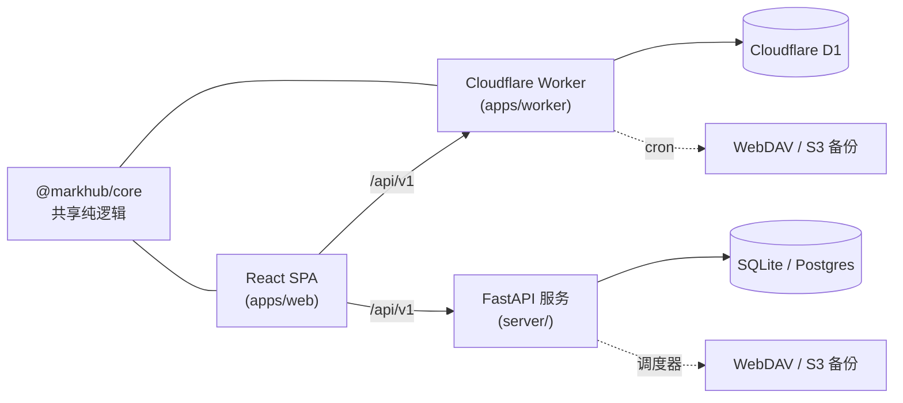

# MarkHub

[English](README.md) | **简体中文**

[](https://deploy.workers.cloudflare.com/?url=https://github.com/NoneAble/mark-hub)

自托管书签导航站：书签按嵌套文件夹分类、打标签、即时搜索，并自动备份到 WebDAV 或 S3/R2。支持一键部署到 **Cloudflare Workers + D1**（免费套餐即可运行），或用 **Docker**（FastAPI + SQLite/Postgres）自建。

所有操作都在同一个页面完成——没有独立的后台。登录后按 `⌘/Ctrl+E` 进入**编辑模式**，即可就地管理书签、分类和标签（拖拽排序、批量操作、归档）；账号、导入导出和备份设置在右上角菜单中。

## 功能特性

- **文件夹 / 分类** — 嵌套树形结构，每个文件夹独立可见性（公开 / 不公开列出 / 私密），拖拽排序，系统收件箱
- **书签管理** — 快速添加并自动抓取标题 / 描述 / 网站图标，收藏、归档，批量移动 / 打标签 / 改可见性
- **标签** — 彩色标签、标签管理、按标签搜索
- **搜索** — 基于 FTS5 的全文搜索（标题、URL、描述、标签），自动回退到 LIKE 模糊匹配
- **公开首页** — 把公开文件夹发布成导航站；未登录访客看不到私密内容
- **导入 / 导出** — 无损 JSON、CSV、Netscape HTML（浏览器书签兼容）；支持 `skip_duplicate` / `merge` / `replace_all` 三种策略；`replace_all` 完全原子化并带用户级互斥锁，经 5 万条书签规模验证
- **定时远程备份** — WebDAV 与 S3/R2 每日备份，自动清理旧备份（retention），支持连接测试，清理失败在界面上可见
- **单管理员账号** — JWT 认证，首次登录强制改密，备份凭据加密存储

## 架构

两套可互换的运行时实现同一份 REST API（`/api/v1`），共用同一个 React SPA。共享逻辑（URL 归一化、可见性规则、导入解析、备份调度）收敛在一个 TypeScript 包里，并有实时 parity 测试套件保证两个后端行为一致。



```
apps/web          React + Vite SPA（公开首页、编辑模式、设置）
apps/worker       Cloudflare Workers + D1 运行时（API + cron 备份）
server/           FastAPI 运行时（Docker；SQLite 或 Postgres，定时备份）
packages/core     共享纯逻辑（normalizeUrl、可见性、导入解析、调度）
packages/api-client, packages/ui
docker/           多阶段 Dockerfile（构建 SPA，由 FastAPI 托管）
scripts/          测试基建 + 仓库内置 bounded-run 看门狗
```

## 部署

### 方式一 — Cloudflare Workers 一键部署

[](https://deploy.workers.cloudflare.com/?url=https://github.com/NoneAble/mark-hub)

点击按钮后，Cloudflare 会把本仓库克隆到你的 GitHub 账号，**自动创建 D1 数据库**（`wrangler.toml` 里的占位 `database_id` 会被自动改写），配置推送即部署的 CI，并根据 [.dev.vars.example](.dev.vars.example) 提示你填写三个密钥：

| 密钥 | 用途 |
|---|---|
| `JWT_SECRET` | 登录令牌签名（≥ 16 字符） |
| `MARKHUB_MASTER_KEY` | 加密存储的备份凭据（≥ 24 字符） |
| `DEFAULT_ADMIN_PASSWORD` | 初始管理员密码（不能是 `admin123`；首次登录强制修改） |

构建阶段运行 `pnpm run build`（SPA 产出到 `apps/web/dist`）；部署脚本先执行 D1 migrations 再 `wrangler deploy`。`*/15 * * * *` 的 cron 触发器负责定时备份和垃圾回收，会在你配置的 `backup_time` 所在的 15 分钟窗口内执行（按亚洲/上海时区）。

### 方式二 — Cloudflare Workers 手动部署

```bash
pnpm install && pnpm run build
pnpm exec wrangler login
pnpm exec wrangler d1 create markhub      # 把返回的 id 填入 wrangler.toml → database_id
pnpm exec wrangler secret put JWT_SECRET
pnpm exec wrangler secret put MARKHUB_MASTER_KEY
pnpm exec wrangler secret put DEFAULT_ADMIN_PASSWORD
pnpm run deploy                           # 先对远程 D1 应用 migrations，再部署

# 冒烟验证
curl -sS "https://<your-worker>.workers.dev/api/v1/health"
```

### 方式三 — Docker（FastAPI）

```bash
./scripts/generate-docker-env.sh   # 或：cp .env.example .env 并填写密钥
docker compose up --build                          # SQLite 卷 → http://localhost:8080
docker compose --profile postgres-app up --build   # Postgres 全栈 → http://localhost:8081
```

缺少真实密钥（`JWT_SECRET`、`MARKHUB_MASTER_KEY`、`DEFAULT_ADMIN_PASSWORD`、`POSTGRES_PASSWORD`）时 Compose 会直接报错拒绝启动；应用本身也会拒绝已知的弱密钥。Postgres 全栈模式下数据库只在 compose 内部网络可达，不向宿主机开放端口。

## 本地开发

```bash
# API（FastAPI）
cd server && python3 -m venv .venv && source .venv/bin/activate
pip install -r requirements.txt
JWT_SECRET=dev-secret-16chars-plus MARKHUB_MASTER_KEY=dev-master-key-24-chars-plus \
DEFAULT_ADMIN_PASSWORD=dev-strong-password uvicorn app.main:app --reload --port 8000

# Web（Vite 把 /api 代理到 127.0.0.1:8000）
pnpm install && pnpm --filter @markhub/core build
pnpm --filter @markhub/web dev

# Worker 运行时（先构建 SPA，再本地 D1 开发）
pnpm run dev:cf
```

## 测试

发布验收只需一个入口：

```bash
pnpm run test:release
# TS+Python lint → core 单测 → worker 套件（类型漂移、D1 运行时——含原子恢复
# 与 lease 互斥测试、远程备份、assets/导航路由）→ pytest → 浏览器 E2E
# → Docker 生命周期 → 5 万条书签恢复门

MARKHUB_RELEASE_SKIP_LARGE=1 pnpm run test:release   # 跳过较慢的 5 万条门
```

单独套件：`pnpm test:core`、`pnpm --filter @markhub/worker test`、`pnpm test:server`、`pnpm test:e2e`、`pnpm test:docker`、`pnpm test:parity`。所有测试基建都在仓库内自包含——干净 checkout + `pnpm install`（外加 `server/.venv`）即可运行。

## 配置参考

### Worker（密钥通过 `wrangler secret put` / `.dev.vars` 注入）

| 变量 | 必填 | 说明 |
|---|---|---|
| `JWT_SECRET` | 是 | ≥ 16 字符 |
| `MARKHUB_MASTER_KEY` | 是 | ≥ 24 字符；用于加密 WebDAV/S3 凭据 |
| `DEFAULT_ADMIN_PASSWORD` | 是 | 不能是 `admin123` |
| `DEFAULT_ADMIN_USERNAME` | 否 | 默认 `admin`（在 `[vars]` 中） |

### FastAPI（环境变量）

| 变量 | 必填 | 说明 |
|---|---|---|
| `JWT_SECRET`、`MARKHUB_MASTER_KEY`、`DEFAULT_ADMIN_PASSWORD` | 是 | 语义同 Worker |
| `DATABASE_URL` | 否 | 默认 `sqlite+aiosqlite:///./data/markhub.db`，或 `postgresql+asyncpg://…` |
| `FORCE_ADMIN_PASSWORD_CHANGE` | 否 | 默认 `true` |
| `CORS_ORIGINS` | 否 | 逗号分隔，默认 `*` |

## 设计要点

- **原子恢复** — `replace_all` 先把数据分块写入 staging 表，再用带用户级 lease 保护的单个 D1 batch 原子切换：恢复期间的并发写入返回 `423`，第二个恢复请求返回 `409`，FTS 索引重建也在同一个原子 batch 内——"恢复成功"就意味着立即可搜索。实例被杀导致的 staging 残留由 cron 回收。
- **备份可观测性** — 旧备份清理会逐个上报失败的对象（`retention_failures` + 计数），持久化最近一次错误，设置界面会持续显示告警，直到下一次完全成功的备份将其清除。
- **双运行时同一契约** — parity 测试用相同请求同时打两个后端并对比响应差异。

## 许可证

[MIT](LICENSE)
