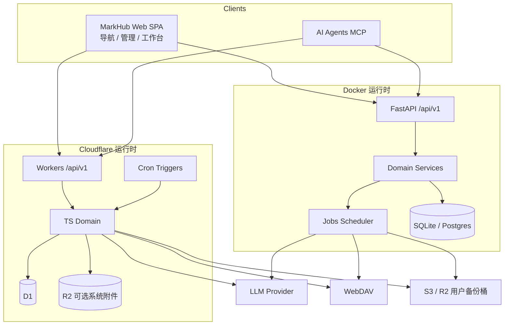
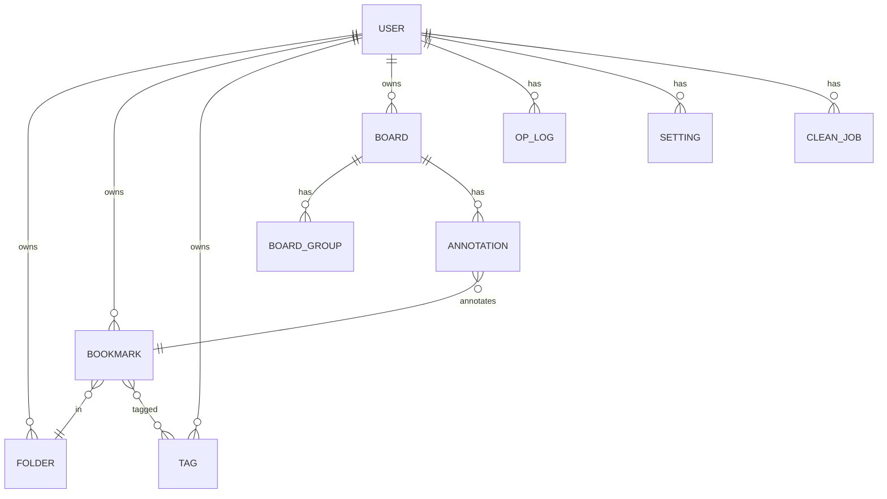
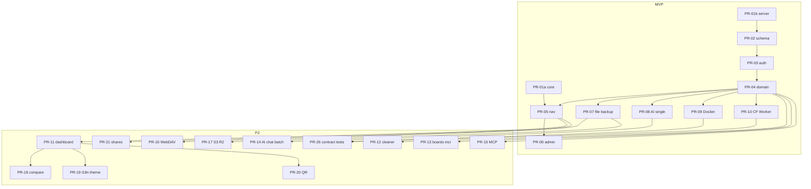

# MarkHub 书签管理平台 — 完整设计文档

| 字段 | 值 |
| --- | --- |
| 文档标题 | MarkHub 书签管理平台完整设计（综合 LiteMark + Smart-Bookmark 能力，Web 多部署形态） |
| 产品名 | **MarkHub** |
| 作者 | TBD |
| 日期 | 2026-07-12 |
| 状态 | Draft（Rev 5 — 用户决议落盘：Web-only / CF 部署 / S3·R2 备份 / 增量 scan） |
| 调研输入 | [`mark.md`](/Users/hj/Documents/Project/Refer/mark.md) |
| 参考实现 | LiteMark（Web 自托管 + Workers）、Smart-Bookmark（功能能力源，**不采用扩展交付**） |
| 前版 | Rev 4（含扩展双端）；本版按用户决策重写产品形态 |

---

## Overview

**MarkHub** 是一款**自托管 Web 书签管理与导航平台**。它在产品能力上综合 LiteMark 与 Smart-Bookmark 的功能全集，但在**交付形态上对齐 LiteMark**：浏览器访问的 SPA + 后端 API，支持 **Docker** 与 **Cloudflare（Workers + D1 + 可选 R2）** 等多种部署；**不做浏览器扩展**。

服务端书签库是唯一 Source of Truth。用户在 Web 前台浏览/编辑公开导航，在后台管理书签树、清理、AI、场景工作台、备份与 MCP。浏览器书签通过 **HTML/JSON/CSV 导入**进入系统，不做 Chrome 双向同步。

目标用户：**单管理员**个人站（预留 `user_id` 列，不实现多用户注册/RBAC）。

---

## Background & Motivation

### 当前状态

| 参考项目 | 解决的问题 | 能力盲区 |
| --- | --- | --- |
| **LiteMark** | 自托管书签库、公开导航、隐藏书签、AI 分类/摘要/快速添加、JSON/CSV/HTML 备份、WebDAV、MCP+OAuth、Docker/Workers | 无树形文件夹、无死链清理、无对比搜索、无场景工作台、无 S3/R2 备份 |
| **Smart-Bookmark** | 清理中心、看板交互、对比搜索、AI 对话、渠道状态板、Discover、主题/i18n | 扩展形态；无服务端、无公开导航、无 MCP、无远程定时备份 |

### 痛点

1. 想要 **可部署的导航站**，又要 **清理 / 场景标注 / 对比搜索** 等扩展级能力。  
2. LiteMark 备份仅 WebDAV，缺少 **S3 兼容（含 Cloudflare R2）** 定时备份。  
3. 扩展商店权限与分发成本高；用户明确要求 **纯 Web 多部署**。

### 产品一句话

> **MarkHub = 可 Docker / Cloudflare 部署的 Web 书签中枢：公开导航 + 树形管理 + 清理 + AI + 场景工作台 + MCP + WebDAV/S3·R2 定时备份。**

---

## Goals & Non-Goals

### Goals

1. **Web-only 交付**：公开导航页 + 管理后台 + 工作台页面；响应式双端浏览器访问。  
2. **功能能力覆盖** `mark.md` 两侧能力域（扩展壳改为 Web 内页面/组件，见映射矩阵）。  
3. **树形 Folder + 多标签 + 可见性**（private / unlisted / public）+ 归档/收藏。  
4. **清理中心**：失效 / 重复 / 空文件夹 / 异常 URL + 书签画像（扫描服务端库）。  
5. **AI**：服务端代理（分类 / 摘要 / 快速添加 / 批量 / 对话 / MCP）；**不**在浏览器存 Key。  
6. **场景工作台（Boards）**：广义化 AI Channels；**全量 + 增量 scan**（Phase 2 紧接上线）。  
7. **备份**：JSON / CSV / HTML 导入导出 + **WebDAV** + **S3 兼容（R2）**，含测试连接与定时任务。  
8. **部署双轨**：  
   - **Docker**（FastAPI + SQLite/Postgres 卷）：全功能一等公民。  
   - **Cloudflare Workers + D1**（对齐 LiteMark 路径）：核心 CRUD/导航/导入导出/AI 单次/MCP 基础/备份配置；后台长任务能力矩阵见部署章。  
9. **单管理员**鉴权（JWT）；匿名可读 public 导航。

### Non-Goals

1. 浏览器扩展 / New Tab 替换 / 悬浮球 content-script / 商店上架。  
2. 多用户注册、团队 RBAC、SaaS 计费。  
3. 自动双向同步 Chrome 书签。  
4. Pocket / Raindrop 等第三方 OAuth 同步。  
5. 实时多用户协作（OT/CRDT）。  
6. 自研 LLM。  
7. Firefox/Safari 扩展、PWA 安装包（PWA 可选后续，非目标）。

### 能力形态映射（扩展能力 → Web）

| Smart-Bookmark 能力 | MarkHub Web 落点 |
| --- | --- |
| 新标签页看板 | `/app` 工作台 Dashboard（文件夹树 + 卡片墙 + 设置密度/壁纸） |
| 侧边栏搜索 | 工作台全局搜索 + 可选窄栏布局 |
| Popup / 快捷键 / 悬浮球 | **不做**；用 PWA 快捷方式 / 浏览器书签到 `/app` 替代 |
| 右键生成二维码 | 卡片菜单「生成二维码」 |
| 清理中心 | `/app/cleaner` |
| 对比搜索 | `/app/compare` |
| AI 对话 | `/app/ai` |
| AI 渠道 | `/app/boards`（默认板类型 `ai_channels`） |
| Discover | `/app/discover`（可插拔 Widget） |
| 本地 chrome.bookmarks | **导入 HTML**；无 Local-only 模式 |

---

## 用户决议（2026-07-12）— 已关闭的 Open Questions

| # | 议题 | 决议 |
| --- | --- | --- |
| 1 | 产品名 | **MarkHub** |
| 2 | 存储与部署 | **对齐 LiteMark**：Docker（SQLite/Postgres）+ **Cloudflare 部署存储（D1）**；应用数据不依赖浏览器 |
| 3 | 账号模型 | **单管理员** |
| 4 | AI Key 路径 | **仅服务端代理**（后台配置 API Key；前端不直连 LLM） |
| 5 | 渠道状态中文 | **不保留**「有货/下架」库存语义；改用中性文案（见 §10） |
| 6 | 交付形态 | **不做扩展**；LiteMark 式 Web + 多种部署 |
| 7 | Board scan | **紧接做增量**（与 Boards 同阶段，非远期） |
| 8 | 对象存储备份 | **S3 兼容配置**（含 R2：端点、区域、桶、Key 前缀、AK/SK）+ **测试连接** + **定时备份** |

---

## Key Decisions

| # | 决策 | 选择 | 理由 |
| --- | --- | --- | --- |
| KD-1 | 产品形态 | **纯 Web SPA + API** | 用户决议 #6；降低权限/商店成本 |
| KD-2 | SoT | **服务端书签库** | 跨设备一致；CF/Docker 同源 API |
| KD-3 | 组织模型 | **树形 Folder + 多标签 + visibility** | 融合 LM 标签/隐藏与 SB 树 |
| KD-4 | LM 兼容 | `category` → 根下一级 Folder；空分类 → Inbox | 迁移 |
| KD-5 | 多端一致性 | Web 多标签页用 **REST + 可选 op-log 刷新**；不做扩展 Sync 队列 | 无扩展后简化；仍保留 op_log 供审计/增量 UI |
| KD-6 | 浏览器书签 | **仅导入/导出**，无 Mirror 写回 | 无扩展 |
| KD-7 | AI | **仅服务端代理** | 用户决议 #4；密钥不出端 |
| KD-8 | MCP | Streamable HTTP + Bearer + OAuth Client Credentials | 对齐 LM |
| KD-9 | 场景工作台 | Board + Annotation 外挂层 | 不污染 Bookmark 表 |
| KD-10 | 导入默认 | `skip_duplicate`（`normalizeUrl`） | 安全默认 |
| KD-11 | Web UI | **React + TypeScript**（可共享组件；不绑扩展） | 实现效率；不必 Vue 复用 LM |
| KD-12 | 部署 | **Docker 全功能 + Cloudflare Workers/D1 官方支持** | 用户决议 #2；双实现需共享契约 |
| KD-13 | 鉴权 | 单管理员 JWT + MCP Token + 匿名 public nav | 用户决议 #3 |
| KD-14 | i18n / 主题 | 中英 + 主题预设/强调色/壁纸/密度 | 吸收 SB |
| KD-15 | Discover | 可插拔 Widget | 主线不臃肿 |
| KD-16 | 运行模式 | **仅 Cloud（自托管）**；删除 Local-only / 扩展 Bridge | 用户决议 #6 |
| KD-17 | 变更日志 | 写路径统一 Domain Service + **op_log**（审计、Board 增量、可选实时刷新） | 保留 Rev4 优点 |
| KD-18 | 实时推送 | MVP 不需要 SSE；列表 REST 刷新；P2 可选 | 简化 |
| KD-19 | URL 唯一性 | **允许**同用户多条相同 `url_normalized` | 对齐多文件夹收藏 |
| KD-20 | 删除 | 软删 30 天 GC；`FolderDeleteMode` 枚举 | 一致 |
| KD-21 | 可见性 | effective = 祖先链最严格（private > unlisted > public） | 防泄漏 |
| KD-22 | 密钥 | Fernet + `MARKHUB_MASTER_KEY`；GET 永不回传明文 | 安全 |
| KD-23 | 树 | 邻接表 `parent_id`；深度 ≤ 32 | 简单 |
| KD-24 | Annotation | 核心列 + `fields jsonb` | 查询/扩展平衡 |
| KD-25 | 写入口 | **唯一 Domain Service** 事务内 entity + op_log | 防旁路 |
| KD-26 | 搜索 | SQLite FTS5 / D1 FTS / PG tsvector | 性能 |
| KD-27 | CSV | MVP 支持 | 与 LM 对齐 |
| KD-28 | 时钟 | 所有写路径 `updated_at = server_now()` | 无客户端离线队列后更简单 |
| KD-29 | 系统夹 | 虚拟 root + `inbox`（`is_system`） | 删除/清理语义 |
| KD-30 | Boards | **仅服务端**；扫描服务端 folder 树 | 无 Local-only |
| KD-31 | 导入多 URL | skip：任意 live 命中；merge：目标夹优先否则 oldest live | 明确 |
| KD-32 | Reorder | 物化 `sort_order` + `reorder_clocks` + 单条 reorder op | 并发顺序 |
| KD-33 | Settings 密钥 | 永不进入 op_log / 导出明文 | 安全 |
| KD-34 | 对比引擎模板 | `%s` 主、`{q}` 别名 | 兼容 SB 引擎表 |
| KD-35 | 系统夹守卫 | 全写路径禁止删/改 is_system/改 parent/改 visibility | 一致 |
| KD-36 | Reorder 时钟 | `reorder_clocks` 必选 | 可实现 |
| KD-37 | **产品名** | **MarkHub** | 用户决议 #1 |
| KD-38 | **备份目标** | WebDAV **与** S3 兼容（R2）可并存；各自开关与 cron | 用户决议 #8 |
| KD-39 | **Board 增量** | Phase 2 与 Boards 同批交付：基于 `op_log` / `updated_at` 水位增量 scan | 用户决议 #7 |
| KD-40 | **状态文案** | 中性：可用 / 受限 / 待验证 / 观察中 / 失效 / 屏蔽（**不用**库存语义） | 用户决议 #5 |
| KD-41 | **CF 数据** | 书签主存 **D1**；大备份文件可写 **R2**（与用户 S3 备份配置独立的系统备份可选） | 用户决议 #2 |
| KD-42 | **双运行时策略** | `packages/core`（TS 纯逻辑）+ OpenAPI 契约；Docker=Python 实现；Workers=TS 实现 **同一 API**；长任务能力见矩阵 | 控制分叉 |

**文件夹删除枚举：**

```typescript
type FolderDeleteMode =
  | "move_to_parent"       // 默认
  | "move_to_inbox"
  | "cascade_soft_delete";
```

---

## 功能映射矩阵（全集落点）

| 能力域 | 来源 | MarkHub 落点 |
| --- | --- | --- |
| 书签 CRUD | 双方 | Domain + REST + MCP + Web UI |
| 树形文件夹 | SB | `folders` 邻接表 + 拖拽 |
| 扁平分类兼容 | LM | 一级 folder |
| 标签 | LM | tags M2M |
| 隐藏/公开/归档 | LM+扩展 | visibility 合成 KD-21 |
| 公开导航页 | LM | `/` |
| 前台编辑模式 | LM | 登录后 Home 编辑 |
| 工作台看板 | SB New Tab | `/app` Dashboard |
| 清理中心 | SB | `/app/cleaner` + jobs API |
| 书签画像 | SB | `/api/v1/analytics/profile` |
| 对比搜索 | SB | `/app/compare` |
| AI 结构化 | LM | `/api/v1/ai/*` 服务端代理 |
| AI 对话 | SB | `/app/ai` + 服务端 chat |
| MCP + OAuth | LM | `/mcp` |
| AI 渠道工作台 | SB | `/app/boards` + 全量/增量 scan |
| Discover / Widgets | SB | `/app/discover` |
| 二维码 | SB | 卡片菜单组件 |
| 备份 JSON/CSV/HTML | 双方 | `/api/v1/backup/*` |
| WebDAV 定时 | LM | 配置/测试/立即/定时 |
| **S3/R2 定时** | 新 | 配置/测试/立即/定时（KD-38） |
| 主题 / i18n | SB+LM | settings |
| Docker | LM | MVP |
| Cloudflare Workers+D1 | LM | 官方支持（能力矩阵） |
| About / 版本检查 | LM | version + latest |
| 扩展/商店/悬浮球 | SB | **明确不做** |

---

## Proposed Design

### 1. 系统架构



**原则：** 浏览器只谈 HTTP API；部署差异关在运行时适配层；**契约（OpenAPI + `packages/core` 类型）唯一**。

### 2. 仓库结构

```text
markhub/
├── apps/
│   ├── web/                 # React SPA：/ 导航 + /admin + /app 工作台
│   └── worker/              # Cloudflare Workers 入口（TS）
├── packages/
│   ├── core/                # normalizeUrl、可见性合成、导入解析、scan 纯函数、状态枚举
│   ├── api-client/          # fetch 封装
│   └── ui/                  # 卡片、树、二维码、主题
├── server/                  # Python FastAPI（Docker）
│   ├── app/
│   │   ├── api/
│   │   ├── domain/
│   │   ├── mcp/
│   │   ├── jobs/            # AI batch / clean / webdav / s3 / board scan
│   │   └── security/
│   └── migrations/
├── docker/
├── wrangler.toml            # CF 配置
└── docs/openapi.yaml
```

### 3. 信息架构（路由）

| 路径 | 说明 | 鉴权 |
| --- | --- | --- |
| `/` | 公开导航（仅 effective public） | 匿名 |
| `/s/{token}` | 分享页 | token / 可选密码 |
| `/admin/login` | 管理员登录 | 匿名 |
| `/admin/*` | Overview / Bookmarks / Folders / Tags / Backup / AI / Settings / Account / About / MCP | JWT |
| `/app` | 工作台 Dashboard（树 + 卡片 + 搜索） | JWT |
| `/app/cleaner` | 清理中心 | JWT |
| `/app/compare` | 对比搜索 | JWT |
| `/app/ai` | AI 对话 + 快捷工具入口 | JWT |
| `/app/boards` | 场景工作台 | JWT |
| `/app/discover` | Discover Widgets | JWT |
| `/app/settings` | 工作台偏好（密度/壁纸/引擎等，写入 settings） | JWT |

> 前台 `/` 登录后可进入「编辑模式」（对齐 LM），与 `/admin` 能力重叠处共享组件。

### 3.1 系统文件夹 Bootstrap（KD-29 / KD-35）

| 逻辑名 | 存储 | 规则 |
| --- | --- | --- |
| root | 虚拟 | `parent_id=null` 的顶层夹挂于此 |
| inbox | 实体 `is_system=true`, `visibility=private`, `parent_id=null` | 不可删、不可改 is_system/parent/visibility；**可改名**；可向内移入书签 |

- `FolderDeleteMode.move_to_inbox` → `settings.inbox_folder_id`  
- Cleaner 空文件夹排除 `is_system`  
- LM 迁移：无 category → inbox  

### 4. 写路径与 op_log（无扩展 Sync 队列）

```mermaid
sequenceDiagram
  participant U as User Browser
  participant W as Web SPA
  participant S as MarkHub API
  participant D as Domain Service
  participant DB as DB

  U->>W: 编辑书签
  W->>S: PATCH /api/v1/bookmarks/{id}
  S->>D: update_bookmark()
  D->>DB: BEGIN; UPDATE; INSERT op_log; COMMIT
  S-->>W: entity + server_cursor
  W->>W: 乐观更新 UI

  U->>W: 触发清理
  W->>S: POST /api/v1/clean/jobs
  S->>D: enqueue job
```

- **所有** REST / MCP / AI quick-add / import / clean apply / board scan 写标注 → Domain Service。  
- `updated_at` 一律 **server_now**（KD-28）。  
- op_log 用途：审计、Board 增量 scan 水位、多标签页可选 `GET /changes?since=` 刷新（**非**离线客户端推送协议）。

### 5. 变更游标 API（轻量，替代扩展 Sync）

```http
GET /api/v1/changes?since={cursor}&limit=500
```

响应：`{ changes: OpLogRow[], next_cursor, has_more }`。  
Web 工作台可 15–30s 轮询以合并其他标签页的修改。MVP 可仅 REST 重拉列表。

OpLog 实体类型与快照形状（Bookmark/Folder/Tag/Annotation/Board/…/reorder）沿用 Rev4 类型定义（见附录 A 摘要）；**删除**扩展 `device_id` 离线 push / 客户端时钟 LWW 特殊路径。若未来需要多设备离线，再恢复完整 Sync；当前 **不做**。

### 6. 公开导航与可见性（KD-21）

**effective_visibility(node) = min_rank(self, ancestors)**  
rank: private=0, unlisted=1, public=2（取最小 = 最严）。

`GET /api/v1/nav/public`：

- 返回树：仅 effective==public 的 folder/bookmark。  
- private 夹下即使书签标 public → **不可见**。  
- unlisted：不进 public nav；可通过 share link 访问。  

LM 映射：`visible=true` → `public`；`false` → `private`。

### 7. 清理中心

扫描服务端 live 书签/文件夹：

| kind | 规则 |
| --- | --- |
| invalid | 可选 HEAD/GET；并发默认 8；SSRF denylist |
| duplicate | `normalizeUrl` 分组；issue 指向**非规范副本**（保留 oldest 或用户指定） |
| empty-folder | count=0 且非 system |
| broken-url | URL 解析失败/异常协议 |

流程：创建 job → 写 `clean_issues` → 用户勾选 → `POST /clean/apply` **仅软删选中实体**；duplicate **不**整组删；可选 `mark_link_status`；issue 保留 7 天。

画像：`GET /api/v1/analytics/profile`（总数、Top 域名、近 30 天新增、趋势）。

### 8. AI 子系统（服务端代理 only）

| 能力 | 端点 |
| --- | --- |
| 状态 | `GET /api/v1/ai/status` |
| 分类 | `POST /api/v1/ai/classify` |
| 摘要 | `POST /api/v1/ai/summarize` |
| 抓取信息 | `POST /api/v1/ai/fetch-page-info`（无 LLM） |
| 快速添加 ×3 | `quick-add` / `with-title` / `with-category` |
| 批量 | `POST /api/v1/ai/batch` → task |
| 任务 | `GET /api/v1/ai/tasks`、`GET /api/v1/ai/tasks/{id}` |
| 对话 | `POST /api/v1/ai/chat`（stream SSE） |

- Key/Base URL/Model 存 settings（Fernet）。  
- Chat 上下文：服务端组装书签摘要（总数、Top 文件夹、样本 URL），**不**把全库明文无必要外送。  
- Workers：batch 后台任务可能降级为同步短批或 501（见能力矩阵）。

### 9. MCP 工具表

| 工具 | 说明 |
| --- | --- |
| `list_markhub_bookmarks` | 过滤 category/folder/query/include_hidden |
| `get_markhub_bookmark` | by id |
| `add_markhub_bookmark` | 创建 |
| `update_markhub_bookmark` | 更新字段 |
| `delete_markhub_bookmark` | 默认软删 |
| `list_markhub_folders` / `add` / `rename` / `delete` | delete 带 mode |
| `list_markhub_tags` / `add` / `rename` | |
| `reorder_markhub_bookmarks` / `reorder_markhub_folders` | |
| `list_markhub_boards` / `scan_board` | 可选 Phase 2 |

认证：Bearer MCP Token 或 OAuth CC（`client_id=markhub-mcp`）。默认关闭。

### 10. Boards 与增量 Scan（KD-39 / KD-40）

#### 10.1 模型

```text
Board { id, name, type: ai_channels|reading_list|custom, source_folder_ids[], schema_version, last_full_scan_at, last_incremental_cursor, ... }
BoardGroup { id, board_id, name, color, keywords[], sort_order, collapsed }
Annotation {
  id, board_id, bookmark_id,
  status, risk, price_tag, category, group_id, secondary_group_ids[],
  note, source_ref, source_folder_id, source_folder_path,
  present, first_seen_at, last_seen_at, missing_since,
  annotation_updated_at, fields jsonb
}
```

#### 10.2 状态文案（中性，KD-40）

| status | 中文 | English |
| --- | --- | --- |
| active | 可用 | Active |
| limited | 受限 | Limited |
| pending | 待验证 | Pending |
| watching | 观察中 | Watching |
| dead | 失效 | Dead |
| blocked | 屏蔽 | Blocked |

风险：低/中/高；价格：S/A/B/C/未评。

#### 10.3 扫描算法

**全量 scan（手动或首次）：**

1. 解析 `source_folder_ids` 子树，收集 live bookmarks。  
2. 按 `bookmark_id` 或 `url_normalized` 匹配已有 annotation。  
3. 命中：更新 title/url/path，`present=true`，`last_seen_at=now`。  
4. 未命中：创建 annotation，默认 status=`pending`，猜测 category/risk。  
5. 本次未出现的旧 annotation：`present=false`，写 `missing_since`。  
6. 可选：按 group keywords 自动归组。  
7. 更新 `last_full_scan_at`，`last_incremental_cursor = max(op_log.id)`。

**增量 scan（KD-39，与 Boards 同阶段）：**

```text
watermark = board.last_incremental_cursor
changes = op_logs where user_id=? and id > watermark
  and entity_type in (bookmark, folder, reorder)  -- 影响树成员
for each change:
  if bookmark upsert in source subtree → upsert annotation present
  if bookmark delete/move out → mark missing
  if folder delete/move → re-eval membership
board.last_incremental_cursor = max applied
```

- 触发：手动、保存 source 后、**定时**（如每 15min，可配）、书签 Domain 写后 **debounce 事件**（Docker job 队列；Workers 用 Cron + 短任务）。  
- 若 watermark 落后过多（如 op_log 已压缩）：**自动降级全量**。  
- 导出：JSON（兼容迁移 SB `ai-channels` 字段映射）+ 分享 HTML。

### 11. Widget / Discover

注册表驱动：`github_trending`、`newsnow`、`info_entries` 等；设置显隐。Workers 注意出站 fetch 限额。

### 12. 搜索与对比搜索

- 库内：FTS 标题/URL/描述/标签。  
- 对比页：多引擎并排；内置表对齐 SB `engines.ts`（**无 YouTube 内置**）；自定义引擎 `%s` / `{q}`。  
- 禁 iframe 引擎新窗口打开。

### 13. 备份子系统

#### 13.1 文件导入导出

| 格式 | 导出 | 导入 |
| --- | --- | --- |
| JSON | 书签树 + folders + tags + category 兼容 + 可选 boards | 支持 |
| CSV | 行式字段 | 需 title,url |
| HTML | Netscape | 解析 A HREF |

导入策略：`skip_duplicate`（默认）/ `merge` / `replace_all`（需 confirm）；规则 KD-31。

#### 13.2 WebDAV（对齐 LM）

配置：`url, username, password, path, keep_backups, enabled, backup_time`  
API：GET（含 `?test=true`）/ PUT / POST 立即备份。  
定时：Docker scheduler；Workers Cron（Asia/Shanghai）。

#### 13.3 S3 兼容 / Cloudflare R2（KD-38，用户决议 #8）

**配置字段：**

```typescript
type S3BackupConfig = {
  enabled: boolean;
  endpoint: string;          // 例 https://xxxx.r2.cloudflarestorage.com
  region: string;            // R2 常用 auto
  bucket: string;
  key_prefix: string;        // 例 markhub-backup/
  access_key_id: string;
  secret_access_key: string; // Fernet 存储；GET 只回 secret_set
  keep_backups: number;      // 默认 7
  backup_time: string;       // HH:mm，Asia/Shanghai
  last_backup_at?: string;
  last_backup_key?: string;
  force_path_style?: boolean; // 默认 true（R2/MinIO 友好）
};
```

**对象键：** `{key_prefix}markhub-backup-YYYY-MM-DD-HH-mm-ss.json`

**API：**

```http
GET  /api/v1/backup/s3              # 配置（密钥脱敏）
GET  /api/v1/backup/s3?test=true    # 测试：HeadBucket 或 ListObjects v2 max-keys=1
PUT  /api/v1/backup/s3              # 保存配置
POST /api/v1/backup/s3              # 立即备份 PutObject
```

**测试连接语义：**

1. 校验 endpoint URL、bucket 非空。  
2. 使用 AK/SK 签名请求。  
3. 成功：`{ ok: true, latency_ms, endpoint_reachable: true }`。  
4. 失败：`{ ok: false, code: "s3_auth"|"s3_network"|"s3_not_found"|"s3_forbidden", message }`。  
5. 超时 10s；**禁止**把 secret 写入日志。

**定时：** 与 WebDAV 共用调度器框架，独立开关；可同时启用两路备份。  
**保留：** 按 key_prefix 列表、按时间排序、删除超出 `keep_backups` 的旧对象。

**Docker：** `boto3` / `aiobotocore`。  
**Workers：** AWS SDK JS v3 S3Client 自定义 endpoint。

### 14. 主题 / i18n

- 语言：auto / zh / en。  
- 主题：system/light/dark + 预设（default/linear/…）+ accent + 壁纸 + cardDensity。  
- Dashboard prefs：`root_folder_id`, `pinned_folder_ids`, `expanded_folder_ids`, `collection_board_name`。

### 15. 部署

#### 15.1 Docker（全功能）

```yaml
# 概念 compose
services:
  markhub:
    image: markhub:latest
    ports: ["8080:80"]
    volumes: ["markhub-data:/app/data"]
    environment:
      JWT_SECRET: ...
      MARKHUB_MASTER_KEY: ...
      DATABASE_URL: sqlite+aiosqlite:///./data/markhub.db
      DEFAULT_ADMIN_USERNAME: admin
      DEFAULT_ADMIN_PASSWORD: admin123
      FORCE_ADMIN_PASSWORD_CHANGE: "true"
```

#### 15.2 Cloudflare（官方支持）

| 资源 | 用途 |
| --- | --- |
| Workers | API + 静态资源 |
| D1 | 主数据库（书签/设置/op_log） |
| R2（可选） | 系统级大文件；**用户备份**走用户配置的 S3/R2 桶 |
| Cron Triggers | WebDAV/S3 定时、board 增量 scan、GC |
| Secrets | JWT_SECRET, MARKHUB_MASTER_KEY, ADMIN_* |

部署方式对齐 LM：`wrangler` / 一键脚本创建 D1、migrate、publish。

#### 15.3 能力矩阵

| 能力 | Docker | CF Workers+D1 |
| --- | --- | --- |
| Auth / CRUD / folders / tags | ✅ | ✅ |
| 公开导航 / share | ✅ | ✅ |
| 导入导出 JSON/CSV/HTML | ✅ | ✅ |
| AI 单次 + fetch-page-info | ✅ | ✅ |
| AI batch 长任务 | ✅ | ⚠️ 短批或队列降级 |
| Clean job 网络探测 | ✅ | ⚠️ 时长/并发受限 |
| Board 全量/增量 scan | ✅ | ✅（Cron + 分片） |
| MCP | ✅ | ✅ 基础 |
| WebDAV 定时 | ✅ | ✅ Cron |
| S3/R2 定时 | ✅ | ✅ Cron |
| FTS | FTS5 | D1 FTS5 |
| SSE Chat | ✅ | ✅（stream） |

**双实现成本（诚实）：** Domain 逻辑尽量放 `packages/core`；Python 与 TS 各写适配层。优先保证 **OpenAPI 契约一致** 与共享测试夹具。

#### 15.4 环境变量

| 变量 | 说明 |
| --- | --- |
| `JWT_SECRET` | 必改 |
| `MARKHUB_MASTER_KEY` | 密钥封装 |
| `DATABASE_URL` | Docker DB |
| `DEFAULT_ADMIN_*` | 仅首次 |
| `FORCE_ADMIN_PASSWORD_CHANGE` | 默认 true |
| `CORS_ORIGINS` | |
| `MCP_ENABLED` | 默认 false |

### 16. 性能与容量

| 指标 | 目标 |
| --- | --- |
| 书签规模 | 5 万舒适 / 10 万可接受 |
| 搜索 P95 | < 100ms @ 2 万（FTS） |
| 增量 scan | < 2s @ 1k op 水位 |
| 死链并发 | 8 |
| 备份 | 日更，默认保留 7 |

---

## API / Interface Changes

统一前缀 **`/api/v1`**。错误体：`{ "error": { "code", "message", "details?" } }`。

### 认证 / 系统

```http
POST /api/v1/auth/login
POST /api/v1/auth/logout
GET  /api/v1/auth/me
PUT  /api/v1/auth/credentials
GET  /api/v1/health
GET  /api/v1/version
GET  /api/v1/version/latest
```

### 书签 / 文件夹 / 标签

```http
GET|POST      /api/v1/bookmarks
GET|PATCH|DELETE /api/v1/bookmarks/{id}
POST          /api/v1/bookmarks/reorder
POST          /api/v1/bookmarks/batch

GET|POST      /api/v1/folders
PATCH|DELETE  /api/v1/folders/{id}   # delete?mode=
POST          /api/v1/folders/reorder

GET|POST      /api/v1/tags
PATCH|DELETE  /api/v1/tags/{id}
```

**batch actions：** `delete | move | set_visibility | set_archived | set_tags`（MVP 整批事务）。  
**reorder：** 物化 sort_order + `reorder_clocks` + op_log。

### 导航 / 分享 / 变更

```http
GET    /api/v1/nav/public
GET    /api/v1/nav/home
GET    /api/v1/changes?since=&limit=
POST   /api/v1/shares
GET    /api/v1/shares/{token}
DELETE /api/v1/shares/{token}
GET    /api/v1/shares                 # 管理列表脱敏
```

### Settings

```http
GET /api/v1/settings
PUT /api/v1/settings
GET /api/v1/settings/mcp
PUT /api/v1/settings/mcp
POST /api/v1/settings/mcp/token
GET /api/v1/settings/ai
PUT /api/v1/settings/ai
POST /api/v1/settings/ai/test
```

密钥字段仅 `*_set: boolean`。

### AI / Clean / Analytics

```http
# AI 见 §8
POST /api/v1/clean/jobs
GET  /api/v1/clean/jobs/{id}
POST /api/v1/clean/apply
GET  /api/v1/analytics/profile
```

**clean/jobs body：** `{ check_invalid: bool, concurrency?: number }`  
**apply body：** `{ issue_ids: string[], mark_link_status?: bool }`

### Boards

```http
GET|POST     /api/v1/boards
GET|PATCH|DELETE /api/v1/boards/{id}
POST         /api/v1/boards/{id}/scan          # { mode: "full"|"incremental" }
GET          /api/v1/boards/{id}/annotations
PATCH        /api/v1/boards/{id}/annotations/{aid}
POST         /api/v1/boards/{id}/annotations/batch
GET|POST     /api/v1/boards/{id}/groups
POST         /api/v1/boards/{id}/groups/reorder
POST         /api/v1/boards/{id}/export         # json|html
POST         /api/v1/boards/{id}/import
```

**annotations/batch：**

```typescript
type AnnotationsBatchRequest = {
  atomic?: boolean; // default true
  items: Array<{
    annotation_id: string;
    patch: Partial<{
      status: string; risk: string; price_tag: string;
      group_id: string | null; secondary_group_ids: string[];
      note: string; category: string;
    }>;
  }>; // max 500
};
```

### Backup

```http
GET  /api/v1/backup/export?format=json|csv|html
POST /api/v1/backup/import
POST /api/v1/backup/import-file

GET|PUT|POST /api/v1/backup/webdav      # POST=run; GET?test=true
GET|PUT|POST /api/v1/backup/s3         # POST=run; GET?test=true  【新增】
```

---

## Data Model Changes

### ER（概念）



### 关键表

- `users`：单行管理员（username, password_hash）  
- `folders`：parent_id, name, sort_order, visibility, is_system, deleted_at  
- `bookmarks`：folder_id, title, url, url_normalized, description, tags 冗余可选, visibility, is_favorite, is_archived, sort_order, ai_*, link_status, deleted_at  
- `tags` / `bookmark_tags`  
- `boards` / `board_groups` / `annotations`  
- `settings(key, value_encrypted_or_plain)`  
- `op_logs`  
- `reorder_clocks(user_id, scope, parent_id, updated_at)`  
- `clean_jobs` / `clean_issues`  
- `share_links`  

索引：`(user_id, url_normalized)` 非唯一；`(user_id, folder_id, sort_order)`；`op_logs(user_id, id)`；FTS。

### 迁移

- 空库 bootstrap admin + inbox。  
- LM JSON → folders/bookmarks 映射。  
- SB HTML 树导入。  
- SB channels JSON → board + annotations 字段映射（status 枚举兼容，UI 文案中性）。

---

## Alternatives Considered

| 方案 | 结论 |
| --- | --- |
| A1. Web + 扩展双端（Rev4） | **否决**（用户 #6） |
| A2. 仅 Docker、不做 CF | **否决**（用户 #2 要求 CF） |
| A3. 仅 Workers | 长任务弱；Docker 仍为一等 |
| A4. AI 浏览器直连 | **否决**（用户 #4） |
| A5. 仅 WebDAV 备份 | **否决**；增加 S3/R2（用户 #8） |
| A6. 渠道库存文案 | **否决**（用户 #5） |
| A7. CRDT 同步 | 过重；Web 单 SoT 足够 |
| A8. Vue 复用 LM | 放弃；React 统一 |

---

## Security & Privacy Considerations

| 威胁 | 缓解 |
| --- | --- |
| 隐藏书签泄漏 | JWT + effective visibility |
| MCP Token | 默认关、哈希、轮换、Origin |
| AI/WebDAV/S3 密钥 | Fernet + 永不 GET 明文 + 日志脱敏 |
| SSRF | 抓取/死链统一 denylist |
| 默认口令 | 强制首次改密 |
| S3 凭据滥用 | 测试/备份最小权限建议（Put/List/Delete 前缀内） |
| replace_all | confirm + 审计 |
| 分享爆破 | 限流 + 可选密码 |

**数据边界：** 书签仅存用户自托管实例；AI 经服务端转发至用户配置的 Provider；备份推送到用户 WebDAV/S3；无强制遥测。

---

## Observability

- JSON 日志：request_id, path, latency, actor  
- Metrics：QPS、5xx、AI 延迟、backup 成败（webdav/s3 分标签）、scan 时长、op_log 体积  
- Health：db、scheduler/cron、master_key、version  
- 审计日志 MVP：login 失败、改密、replace_all、clean apply、MCP 写、备份配置变更、分享

---

## Rollout Plan

### Feature flags

`ff.mcp`, `ff.webdav`, `ff.s3_backup`, `ff.ai_batch`, `ff.cleaner_network`, `ff.public_nav`, `ff.boards`, `ff.board_incremental`, `ff.discover`, `ff.compare`

### 阶段

**MVP**

- 单管理员 Auth、强制改密  
- Folder/Bookmark/Tag CRUD、可见性、公开导航、前台编辑  
- Admin 后台、JSON/CSV/HTML 导入导出  
- fetch-page-info + AI 单次（服务端代理）  
- Docker Compose  
- Cloudflare：D1 CRUD + 导航 + 导入导出 + AI 单次（与 Docker API 对齐子集）

**Phase 2（紧接）**

- Cleaner + 画像  
- Boards **全量 + 增量 scan** + 中性状态文案  
- AI batch/tasks + Chat  
- MCP + OAuth  
- WebDAV **与 S3/R2** 配置/测试/定时  
- 工作台 Dashboard / Compare / 主题 i18n / 二维码  
- Share 最小 API  
- CF Cron 对齐定时任务

**Phase 3**

- Discover Widgets 增强  
- Share 高级 UI  
- 审计表、性能优化、闭包表可选  
- SmartSearch 语义搜索可选

### 回滚

`/api/v1` 版本化；flag 关闭 MCP/备份/网络探测；migration 向前兼容。

---

## Risks

| 风险 | 严重度 | 缓解 |
| --- | --- | --- |
| Docker/Workers 双实现漂移 | High | OpenAPI 契约测试；core 共享；矩阵砍长任务 |
| 范围过大 | High | MVP/P2 列车；扩展能力不做 |
| S3 配置错误导致备份静默失败 | Medium | 测试连接强制；失败告警/About 提示 |
| 增量 scan 漏事件 | Medium | 落后自动全量；压缩策略保守 |
| D1 限制 | Medium | 分页；大库建议 Docker+Postgres |
| LLM 成本 | Medium | 限速；用户自备 Key |

---

## Open Questions

以下为**仍可微调**的非阻塞项（核心 8 项已决议）：

1. Docker 默认 SQLite；是否在 compose 提供 **postgres profile** 作为官方大库路径？（建议：是）  
2. 公开导航域名自定义 / 多站点皮肤是否需要？  
3. Board 增量默认间隔 5 / 15 / 30 分钟？  
4. S3 备份是否默认 `force_path_style=true`？（建议：是，R2 友好）  
5. 是否提供「仅静态导出 HTML 导航」无登录镜像？  

---

## References

1. [`mark.md`](/Users/hj/Documents/Project/Refer/mark.md)  
2. LiteMark：`api.md`, `backend/app/*`, `worker/*`, WebDAV scheduler  
3. Smart-Bookmark：`cleaner.ts`, `utils.ts#normalizeUrl`, `engines.ts`, `types` channels（能力参考）  
4. Cloudflare D1 / R2 / Workers Cron 文档  
5. S3 API ListObjectsV2 / PutObject / DeleteObject  

---

## PR Plan

标注：**MVP** / **P2** / **P3**。无扩展相关 PR。

### PR-00: UI Design — **MVP**
- UI 参考当前目录下的 UI原型设计：ui-design

### PR-01a: monorepo + packages/core — **MVP**
- pnpm、normalizeUrl、可见性纯函数、类型、Vitest  
- 依赖：无  

### PR-01b: Python server 脚手架 — **MVP**
- FastAPI health/version、Ruff/pytest  
- 依赖：无  

### PR-02: Schema + migrations — **MVP**
- users/folders/bookmarks/tags/settings/op_logs/reorder_clocks；FTS  
- 依赖：PR-01b  

### PR-03: Auth 单管理员 + 强制改密 + Fernet — **MVP**
- bootstrap inbox  
- 依赖：PR-02  

### PR-04: Domain CRUD + op_log + 系统夹守卫 — **MVP**
- bookmarks/folders/tags/reorder/batch  
- 依赖：PR-03  

### PR-05: 可见性 + 公开导航 API + Web 只读首页 — **MVP**
- 依赖：PR-04、PR-01a  

### PR-06: Admin 后台 + 前台编辑 + About/version — **MVP**
- 依赖：PR-05  

### PR-07: Backup 文件导入导出 JSON/CSV/HTML — **MVP**
- 依赖：PR-04  

### PR-08: AI 单次 + fetch-page-info + SSRF + 服务端 Key — **MVP**
- 依赖：PR-03、PR-04  

### PR-09: Docker Compose 全栈 — **MVP**
- 依赖：PR-04  

### PR-10: Cloudflare Worker + D1 最小实现 — **MVP**
- 与 PR-04 API 对齐的 CRUD/nav/auth/import/AI 单次  
- 依赖：OpenAPI 冻结（PR-04）；可与 PR-09 并行  

### PR-11: Web 工作台壳 `/app` + Dashboard — **P2**
- 树/卡片/搜索/密度/壁纸 settings  
- 依赖：PR-05、PR-06  

### PR-12: Cleaner + analytics — **P2**
- 依赖：PR-04  

### PR-13: Boards + **全量 scan** + **增量 scan** + 中性状态文案 — **P2**
- annotations/groups/export；watermark；debounce/cron  
- 依赖：PR-04；UI 依赖 PR-11  

### PR-14: AI batch/tasks + Chat SSE — **P2**
- 依赖：PR-08  

### PR-15: MCP + OAuth — **P2**
- 依赖：PR-04  

### PR-16: WebDAV 配置/测试/定时 — **P2**
- 依赖：PR-07、PR-09（Docker）；CF Cron 接 PR-10  

### PR-17: **S3/R2 备份** 配置/测试/立即/定时/保留清理 — **P2**
- 端点、区域、桶、前缀、AK/SK；Fernet；UI 表单  
- 依赖：PR-07；scheduler 与 PR-16 共享  

### PR-18: Compare 对比搜索 — **P2**
- 依赖：PR-11  

### PR-19: 主题预设 + i18n 完整 — **P2**
- 依赖：PR-06、PR-11  

### PR-20: 二维码 + 卡片菜单 — **P2**
- 依赖：PR-11  

### PR-21: Share API + 基础分享页 — **P2**
- 依赖：PR-05  

### PR-22: Discover Widgets — **P3**
- 依赖：PR-11  

### PR-23: Share 高级 UI — **P3**
- 依赖：PR-21  

### PR-24: LM/SB 迁移工具增强 — **P2/P3**
- 依赖：PR-07、PR-13  

### PR-25: 可观测性/审计表 — **P3**
- 依赖：主写路径  

### PR-26: CF 与 Docker 契约一致性测试套件 — **P2**
- 同一 OpenAPI 在两运行时跑烟雾测试  
- 依赖：PR-09、PR-10  

---

### PR 依赖总览



---

## 附录 A：normalizeUrl（规范）

与 Smart-Bookmark 对齐，实现于 `packages/core`：

1. 解析 URL；仅处理 http/https。  
2. host 小写。  
3. 去掉 hash。  
4. 去掉 tracking 查询参数：`utm_*`, `spm`, `fbclid`, `gclid` 等。  
5. 去掉默认端口。  
6. path 去尾部 `/`（根路径保留 `/`）。  

---

## 附录 B：S3/R2 配置 UI 字段校验

| 字段 | 校验 |
| --- | --- |
| endpoint | 必填 URL，https 推荐 |
| region | 必填；R2 默认 `auto` |
| bucket | 必填，DNS 兼容名 |
| key_prefix | 可选；规范化无前导 `/`，确保尾 `/` |
| access_key_id | 必填 |
| secret_access_key | 必填（更新时可留空表示不修改） |
| keep_backups | ≥1 整数 |
| backup_time | `HH:mm` |

---

## 附录 C：Rev 4 → Rev 5 变更摘要

| 项 | Rev 4 | Rev 5 |
| --- | --- | --- |
| 名称 | Refer | **MarkHub** |
| 扩展 | 核心交付 | **删除** |
| Local-only | 有 | **删除** |
| 部署 | Docker 主 / Workers 远期 | **Docker + CF 官方双轨** |
| AI | 可扩展直连 | **仅服务端代理** |
| 渠道文案 | 库存语义 | **中性状态** |
| 备份 | WebDAV | **WebDAV + S3/R2** |
| Board 增量 | 可延后 | **P2 紧接交付** |
| Sync 推送协议 | 扩展离线队列 | **简化为 changes 游标 + server_now** |

---

*Rev 5 结束。实现以 KD-1–42 与用户 2026-07-12 八项决议为准。*
